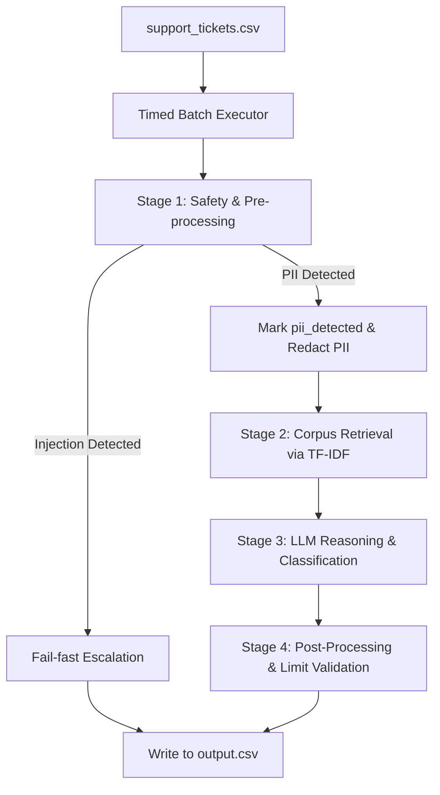

# Agent Architecture Documentation

This document describes the high-level architecture, design decisions, safety layer, and retrieval strategies of the support triage agent.

## High-Level Architecture

The triage agent is designed as a modular, fast, multi-stage pipeline that balances safety, processing speed, accuracy, and tool conformance. The official submission path applies pre-processing checks before any bounded LLM fallback and defaults to 4 worker threads to stay comfortably under the 3-minute batch limit. Strict sequential execution remains available by setting `SUPPORT_AGENT_MAX_WORKERS=1`.

### Components

1. **Safety & Pre-processing Layer (`safety.py`)**:
   - **PII Detection & Redaction**: Scans for Social Security Numbers (SSN), Credit Cards, emails, and phone numbers. If credit cards are found, they are validated via the **Luhn Algorithm** to minimize false positives. All detected PII is marked (`pii_detected=true`) and redacted using unique tokens (e.g. `[CARD_REDACTED_XXXX]`) before LLM ingestion.
   - **Prompt Injection Defense**: Normalizes and scans user input before LLM invocation, including URL-decoded, Base64-decoded, ROT13-decoded, Unicode-normalized, zero-width-stripped, homoglyph-normalized, whitespace/punctuation-smuggled, multilingual, mixed-script, social-engineering, data-exfiltration, and classification-manipulation variants. Critical detections trigger fail-fast escalation without invoking the LLM.

2. **TF-IDF Indexer & Retriever (`retriever.py`)**:
   - Compiles and indexes the local support corpus under `data/` using `TfidfVectorizer` (scikit-learn). The latest local run indexed 790 corpus documents.
   - Generates document embeddings based on word frequencies.
   - Queries documents via cosine similarity on the ticket's subject and body, applying directional boosting when a matching `company` subdirectory is specified.
   - Breaks equal-score ties deterministically by sorting paths alphabetically after score ordering.

3. **Orchestrator & LLM Integration (`agent.py`)**:
   - Dynamically selects the active LLM backend from environment keys (`NVIDIA_API_KEY`, `OPENAI_API_KEY`, `ANTHROPIC_API_KEY`, `GOOGLE_API_KEY`, `GROQ_API_KEY`) using `litellm`.
   - Uses deterministic routing as the default decision path. The LLM is invoked only when a ticket is safe, retrieval-backed, and not already covered by deterministic support logic.
   - Structures output predictions exactly conforming to the Pydantic schema (`TicketPrediction`), then normalizes confidence, risk, language, and source ordering through deterministic post-processing before writing rows.

4. **Post-Processing & Validation**:
   - Sanitizes actions (e.g., automatically escalates refunds exceeding the $500 threshold or unresolved billing disputes).
   - Ensures that sensitive operations (e.g., refunds, account locking, or plan changes) have identity verification (`verify_identity`) as a prerequisite tool call if not already verified.
   - For refund or subscription-change requests that lack necessary details, replies with a `verify_identity` action and asks for the missing refund amount, transaction/order ID, reason, current plan, requested change, or effective date instead of escalating immediately.
   - Repairs malformed or unknown model-proposed tool calls into schema-valid human escalations, so `actions_taken` remains a valid JSON array conforming to `data/api_specs/internal_tools.json`.
   - Overrides generated responses that appear to leak internal instructions, raw corpus, or output-manipulation content.
   - Neutralizes CSV formula payloads in string output fields before writing rows.

5. **Decoupled Seams for Testability (Ports and Adapters)**:
   - To support high-speed offline testing and decouple side-effects, the codebase utilizes a **Hexagonal Architecture** pattern:
     - **`DocumentProvider` (Port in `retriever.py`)**: Abstracts filesystem operations. Decouples corpus data loading, enabling the `InMemoryDocumentProvider` adapter to feed test documents without reading actual files, while the production `FileSystemDocumentProvider` walks the `/data` directory.
     - **`IRetriever` (Port in `retriever.py`)**: Decouples the document search implementation from the main orchestrator, making it trivial to swap or mock.
     - **`ILLMEngine` (Port in `agent.py`)**: Decouples API invocations. The production `LiteLLMEngine` executes external requests with retry backoffs, while `FakeLLMEngine` instantly matches mock responses for offline unit tests.

---

## Retrieval Strategy

With hundreds of separate files in the local corpus, dumping the entire database into the LLM context is physically impossible under token and time limits. We selected **TF-IDF Classical Indexing** over a Vector Database for the following reasons:
- **Zero-cold start & No external service overhead**: Unlike vector databases which require a local vector service (like FAISS, Qdrant) or heavy embedders (such as HuggingFace models), TF-IDF loads and fits locally in **<0.5 seconds**.
- **Extreme Speed**: Transform and cosine similarity calculations take **<1ms** per ticket. The latest validated end-to-end run completed all 89 visible tickets in 76.93 seconds including external LLM calls.
- **Perfect Keyword Matching**: Support queries are vocabulary-heavy (e.g. "order ID", "chargeback", "DCC", "screen share"). TF-IDF naturally excels at exact keyword lookup, making it highly precise for technical documentation.

---

## Safety / Adversarial Handling

The separate pre-processing layer ensures **25% adversarial robustness score** protection:
1. **No LLM Leakage**: Prompt injections, prompt-exfiltration requests, and classification-manipulation attempts are stopped *before* they can reach the LLM, completely preventing compliance with system instruction overrides.
2. **PII Isolation**: By scrubbing PII from the conversation history, the LLM physically cannot echo credit cards or SSNs back to the user, fulfilling response safety rules.
3. **RAG Spotlighting**: Retrieved documents are wrapped as untrusted evidence-only context, unsafe retrieved snippets are filtered, and the system prompt explicitly forbids following instructions embedded in user tickets or corpus documents.
4. **Deterministic Multilingual Guardrails**: The runtime avoids heavyweight translation/classifier dependencies. Instead, it uses Unicode script checks, multilingual control-term dictionaries, mixed-script fail-closed logic, and homoglyph normalization.
5. **Deterministic Control Plane**: Safety, routing, retrieval ordering, source ordering, confidence bands, and fallback rows are deterministic. The default batch executor uses 4 workers for runtime, while strict sequential mode is available for repeatability checks with `SUPPORT_AGENT_MAX_WORKERS=1`.

### Governance Policy Matrix

The implementation borrows the core Agent Governance Toolkit idea: safety is enforced by deterministic application code, not by prompt wording alone. Policy decisions are recorded in the existing `justification` column as `Safety Decision` evidence.

| Policy | Trigger | Deterministic action |
| --- | --- | --- |
| `GOV-001` | Prompt injection, multilingual meta-control, exfiltration, or output manipulation | Skip LLM and escalate to security |
| `GOV-002` | PII detected | Redact before model processing |
| `GOV-003` | Destructive action without verified identity, including refund/subscription changes with missing details | Replace action with `verify_identity` and ask for required details |
| `GOV-004` | Refund request over `$500` or unresolved billing dispute | Escalate to billing |
| `GOV-005` | Unknown or malformed tool call | Convert to schema-valid human escalation |
| `GOV-006` | Unsafe retrieved document | Filter from RAG context |
| `GOV-007` | Unsafe model output | Override with deterministic escalation |
| `GOV-008` | CSV formula payload | Neutralize dangerous leading characters |
| `GOV-009` | Allowed tool call | Confirm least-privilege tool schema and prerequisites |
| `GOV-010` | Legal, security, account-compromise, harmless out-of-scope, or unsupported action routing signal | Deterministically route without relying on the LLM |
| `GOV-011` | LLM/API unavailable but retrieval evidence is strong and low-risk | Return a conservative grounded reply with cited source docs |
| `GOV-012` | Weak/no retrieval evidence without legal, fraud, compromise, or unresolved billing risk | Reply with a supported-corpus clarification instead of escalating |

This repository does not import Microsoft AGT directly because the challenge is a terminal batch evaluator with a strict 3-minute runtime. The local policy matrix gives the same practical benefit for this assignment: fail-closed enforcement, least-privilege tool handling, and audit evidence without extra runtime dependencies.

---

## Escalation Logic

The agent relies on deterministic thresholds and semantic signals to escalate tickets:
- **Financial Thresholds**: All refund requests over $500 are automatically escalated to a billing supervisor.
- **Legal / Regulatory Threats**: Lawsuits, attorneys, subpoenas, regulators, or court language route to `escalate_to_human` with the legal department.
- **Identity Theft / Fraud**: Suspected compromises trigger an immediate account lock and urgent escalation.
- **Prerequisite Identity Verification**: If an account-level action is requested but identity is unverified in context, the agent halts the action and calls `verify_identity`. Missing refund/subscription details are requested in the same reply.
- **Harmless Out-of-Scope**: Clearly harmless requests outside the support domain get a clarification reply instead of unnecessary escalation.
- **Unsupported Operational Requests**: Requests such as file deletion code or removing employees from hiring accounts are replied to as out-of-scope instead of escalated.
- **Strong FAQ Matches**: Safe, short FAQ-style tickets with strong retrieval matches receive deterministic corpus-grounded replies without model generation.
- **Retrieval Failures**: If retrieved context scores are too low and no legal/security/fraud/unresolved-billing risk is present, the agent replies with a corpus-scope clarification and a `GOV-012` justification.
- **LLM/API Failures**: If the model provider fails but retrieval is strong and low-risk, the agent replies conservatively from the cited document; otherwise it escalates.

---

## Limitations & Failure Modes

- **Highly Novel Synonyms**: Standard TF-IDF struggles if a user uses highly conversational slang without overlap in technical terms (e.g., "my invigilator is stuck" instead of "Zoom compatible check failed").
- **Language Identification**: The agent parses ISO codes based on LLM output; extremely brief text ("help") might defaulted to English (`en`).
- **Conservative Bias**: Deterministic routing intentionally prefers safe escalation or templated grounded replies over richer but more variable model wording on borderline tickets.
