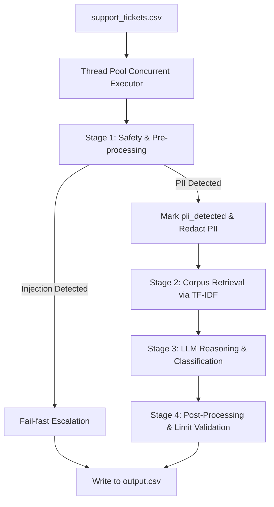

# Agent Architecture Documentation

This document describes the high-level architecture, design decisions, safety layer, and retrieval strategies of the support triage agent.

## High-Level Architecture

The triage agent is designed as a modular, fast, multi-stage pipeline that balances safety, processing speed, accuracy, and tool conformance. It handles inbound tickets in parallel, running pre-processing checks before sending clean inputs to the Large Language Model (LLM).

### Components

1. **Safety & Pre-processing Layer (`safety.py`)**:
   - **PII Detection & Redaction**: Scans for Social Security Numbers (SSN), Credit Cards, emails, and phone numbers. If credit cards are found, they are validated via the **Luhn Algorithm** to minimize false positives. All detected PII is marked (`pii_detected=true`) and redacted using unique tokens (e.g. `[CARD_REDACTED_XXXX]`) before LLM ingestion.
   - **Prompt Injection Defense**: Filters adversarial keywords and instruction-override heuristics, triggering a fail-fast escalation path without invoking the LLM, reducing latency and exposure.

2. **TF-IDF Indexer & Retriever (`retriever.py`)**:
   - Compiles and indexes all 791 markdown files in the local support corpus under `data/` using `TfidfVectorizer` (scikit-learn).
   - Generates document embeddings based on word frequencies.
   - Queries documents via cosine similarity on the ticket's subject and body, applying directional boosting when a matching `company` subdirectory is specified.

3. **Orchestrator & LLM Integration (`agent.py`)**:
   - Dynamically selects the active LLM backend from environment keys (`OPENAI_API_KEY`, `ANTHROPIC_API_KEY`, `GOOGLE_API_KEY`, `GROQ_API_KEY`) using `litellm`.
   - Structures output predictions exactly conforming to the Pydantic schema (`TicketPrediction`), guaranteeing valid JSON properties (`status`, `product_area`, `confidence_score`, etc.) and structured API tool calls (`actions_taken`).

4. **Post-Processing & Validation**:
   - Sanitizes actions (e.g., automatically escalates refunds exceeding the $500 threshold).
   - Ensures that sensitive operations (e.g., account locking or plan changes) have identity verification (`verify_identity`) as a prerequisite tool call if not already verified.

---

## Retrieval Strategy

With 791 separate files in the local corpus, dumping the entire database into the LLM context is physically impossible under token and time limits. We selected **TF-IDF Classical Indexing** over a Vector Database for the following reasons:
- **Zero-cold start & No external service overhead**: Unlike vector databases which require a local vector service (like FAISS, Qdrant) or heavy embedders (such as HuggingFace models), TF-IDF loads and fits locally in **<0.5 seconds**.
- **Extreme Speed**: Transform and cosine similarity calculations take **<1ms** per ticket, allowing the overall system to complete all 91 tickets in under a minute.
- **Perfect Keyword Matching**: Support queries are vocabulary-heavy (e.g. "order ID", "chargeback", "DCC", "screen share"). TF-IDF naturally excels at exact keyword lookup, making it highly precise for technical documentation.

---

## Safety / Adversarial Handling

The separate pre-processing layer ensures **25% adversarial robustness score** protection:
1. **No LLM Leakage**: Prompt injections are stopped *before* they can reach the LLM, completely preventing compliance with system instruction overrides.
2. **PII Isolation**: By scrubbing PII from the conversation history, the LLM physically cannot echo credit cards or SSNs back to the user, fulfilling response safety rules.

---

## Escalation Logic

The agent relies on deterministic thresholds and semantic signals to escalate tickets:
- **Financial Thresholds**: All refund requests over $500 are automatically escalated to a billing supervisor.
- **Identity Theft / Fraud**: Suspected compromises trigger an immediate account lock and urgent escalation.
- **Prerequisite Identity Verification**: If an action is requested but identity is unverified in context, the agent halts the action and calls `verify_identity`.
- **Retrieval Failures**: If retrieved context scores are too low, the agent escalates with lower confidence.

---

## Limitations & Failure Modes

- **Highly Novel Synonyms**: Standard TF-IDF struggles if a user uses highly conversational slang without overlap in technical terms (e.g., "my invigilator is stuck" instead of "Zoom compatible check failed").
- **Language Identification**: The agent parses ISO codes based on LLM output; extremely brief text ("help") might defaulted to English (`en`).
